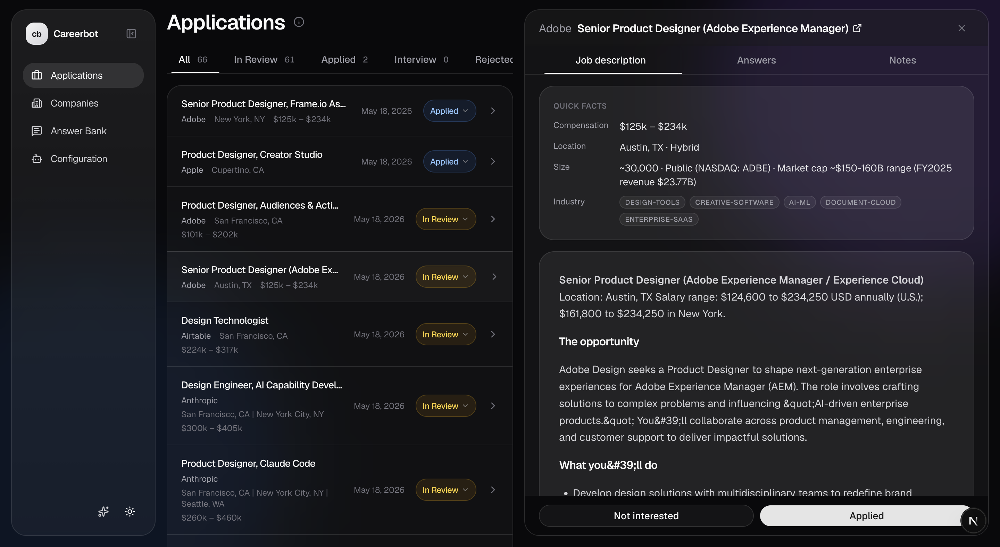

# Careerbot

An AI career assistant. It researches companies, finds open roles that match your preferences, and drafts personalized answers for each application's form, drawing from your Answer Bank of raw material. The same reusable answers get pulled across applications, so you stop rewriting the same "Why us?" essay every week. You review every draft and submit each application yourself.



**CLI-first.** The actual work happens through slash commands in Claude Code (or any AI that supports skills): researching companies, scanning careers pages, drafting answers tailored to each role. The web dashboard is for browsing the same files in a friendlier view, with sorting, filtering, and quick edits for the moments when clicking is faster than typing into the AI. Both interfaces stay in sync because they read and write the same local markdown files.

Careerbot stores **everything as local markdown files** under `applications/`, `companies/`, and `answer-bank/`. One file per application, company, or saved answer. Status is encoded by the parent folder, so a status change is just a `git mv`.


## Two ways to use it

Both interfaces read and write the **same markdown files**. Use either, or both at the same time.

| | **CLI (AI agent)** | **Web dashboard** |
|---|---|---|
| What it's for | Heavy lifting: research companies, find roles, draft application answers | Browsing, editing, and status changes you'd rather click than type |
| How to run | Open the repo in Claude Code (or any agent that supports skills) and run `/find-companies`, `/find-roles`, etc. | `cd web && pnpm install && pnpm dev`, then open http://localhost:3000 |
| What it edits | Markdown files under `applications/`, `companies/`, `answer-bank/` | The same markdown files (via Server Actions) |

You don't have to pick one. Run `/find-roles` in the CLI to draft new applications, then flip to the dashboard to read them, tweak the wording, and move the file from `in-review/` to `applied/`.


## Setup

1. Fill in `context/`:
   - Copy `context/index.example.md` → `index.md` and link to your background material.
   - Copy `context/preferences.example.md` → `preferences.md` and edit (titles, comp floor, locations, deal-breakers).
   - Drop your `resume.pdf` in `context/`.
2. (Optional) Add companies you're curious about to `companies/ideas.md` (copy from `ideas.example.md`).
3. Pick how you want to drive it:
   - **CLI:** open the repo in Claude Code (or another agent that supports skills) and run `/onboard` for a guided first-run setup, then `/find-companies` to start populating `companies/in-review/`.
   - **Web:** `cd web && pnpm install && pnpm dev`, then open http://localhost:3000 to browse and edit the files in your browser.

First time? Run `/onboard` in the CLI; it walks you through everything in step 1 interactively.


## Skills (CLI)

These are the slash commands the AI agent exposes. Each one reads from and writes to the markdown tree.

| Skill | What it does | Writes to |
|---|---|---|
| `/onboard` | First-run setup wizard. Walks you through preferences one section at a time. | `context/preferences.md` |
| `/find-companies` | Finds companies matching your preferences and writes one profile per match. Bad matches go to a rejected/ folder so they never resurface. | `companies/in-review/<slug>.md` + `companies/not-interested/<slug>.md` |
| `/add-company` | Lightweight single-target version of `/find-companies`. Add one company you already know you want. | `companies/interested/<slug>.md` |
| `/add-application` | Paste a job posting URL. Fetches the JD, drafts answers from your Answer Bank, auto-adds the company if not tracked. | `applications/in-review/<co>/<ats-id>-<title-slug>.md` |
| `/find-roles` | Walks every interested company, scans its careers page, filters open roles against your preferences, drafts one application per match. Reuses Answer Bank entries. | `applications/in-review/<co>/<id>.md` |
| `/seed-answer-bank` | Interactively fills any empty answer-bank stubs that `/find-roles` flagged as gaps. | `answer-bank/<theme>/<slug>.md` |
| `/draft-missing-answers` | Re-synthesizes application answers left as TODOs or `[partial - pending: ...]` placeholders, once their underlying stubs are filled. | Edits in place under `applications/in-review/<co>/<id>.md` |
| `/applicationstatus` | Moves an application between status folders and stamps the matching date field. | `git mv` between `applications/<status>/` folders |
| `/commitandpush` | Commits and pushes the public parts of the repo while keeping every instance file private. | (repo operation, no markdown writes) |


## Dashboard (web)

A glassy Next.js dashboard that reads and writes the same markdown tree. See [`web/README.md`](./web/README.md) for details.

```bash
cd web
pnpm install
pnpm dev      # http://localhost:3000
```

What you can do from the dashboard:

- Browse applications, companies, and answer-bank entries as filterable lists.
- Open any item and edit its frontmatter or body inline; saves write back to the same markdown file.
- Change status by moving a file between folders (e.g. mark an application as `applied`).
- **AI Skills** page: a quick reference for every CLI skill with copy-paste examples, for when you forget the exact phrasing.
- **Configuration** page: edit `context/preferences.md` (titles, comp floor, locations, deal-breakers) through a form instead of a text editor.

By default the dashboard auto-detects the repo by walking up from `process.cwd()`. To point at a different repo, set `CAREERBOT_DATA_ROOT` to an absolute path in `web/.env.local`.


## Workflow

```
                /find-companies                    /add-company
                       │                                │
                       ▼                                ▼
        ┌──────────────────────────┐    companies/interested/<slug>.md
        │  companies/in-review/    │
        └──────────────────────────┘                    │
                  │                                     │
              (you decide; mv file                      │
               or click in dashboard)                   │
                  │                                     │
        ┌─────────┴──────────┐                          │
        ▼                    ▼                          │
   .../interested/      .../not-interested/             │
        │                                               │
        └────────────────┬──────────────────────────────┘
                         │
                         ▼
                    /find-roles
                         │
                         ▼
          applications/in-review/<co>/<id>.md
                         │
                /applicationstatus
              (or status change in dashboard)
                         │
                         ▼
    applied/ → interview/ → offered/  /  rejected/  /  withdrawn/
```

Every status change is a `git mv` between status folders. The folder layout *is* the status column, whether you trigger the move from the CLI or by clicking in the dashboard.


## License

MIT. See [`LICENSE`](./LICENSE).
